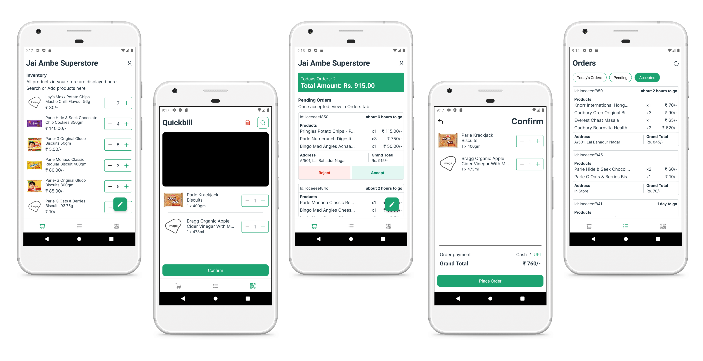

## Locality Store app



Introducing the mobile application designed to revolutionize local retail stores – Locality! With Locality Store app, you can manage your retail store from anywhere in the world, in just 15 minutes. It's never been easier to get started with a retail management app, and the benefits are endless.

Here are some of the features that make Locality Store app the ultimate solution for retail store management:

### Order Management:

Receive orders directly on your phone or tablet in real-time.
Easily accept or reject orders with just a tap.
Keep track of order history and customer details for future reference.
Set up automated order notifications to keep your customers updated.

### Inventory Management:

Keep track of your inventory levels in real-time.
Receive alerts when inventory levels are low or out of stock.
Easily add or remove products and update quantities.
Set up automated inventory reports to stay on top of your stock levels.

### Payment Management:

Manage pending payment accounts and keep track of overdue payments.
Set up automated payment reminders to customers.
Easily view payment history and outstanding balances.
Accept payments directly through the app for hassle-free transactions.

### Other Features:

Easy setup process, with no technical skills required.
Intuitive and user-friendly interface.
Data backup and security to ensure your information is safe.
Access to detailed analytics and reports to help you make informed decisions.
Multilingual support for customers and staff.

With Locality Store app, you can manage your retail store with ease and efficiency, allowing you to focus on growing your business. Say goodbye to the hassle of manual management processes and hello to the future of retail store management.

<br/>

Download Locality Store app today and start managing your retail store from anywhere in the world, in just 15 minutes!

This app is built majorly using React Native, Graphql, react-native-ui-lib, and Redux.

## Installation

1. Clone the repository

```bash
git clone https://github.com/localityorg/user.git locality-user
```

2. Install dependencies

```bash
cd locality-user
npm install
```

3. Run the app

This will start the Metro bundler. You can then run the app on your iOS or Android device using the Expo app.

## Features

- Order groceries or any retail item from your local retail store.
- Maintain your khaata (running account) at your trusted retail stores.
- Choose appropriate delivery time according to your necessity.

## Technologies

- React Native
- react-native-ui-lib
- GraphQL
- Redux
- Apollo Framework

## Contributing

Pull requests are welcome. For major changes, please open an issue first to discuss what you would like to change.
